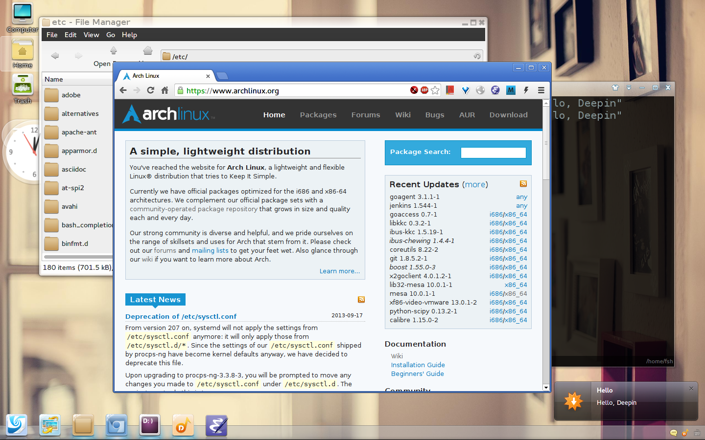
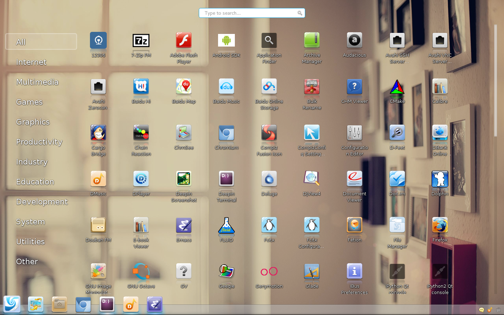
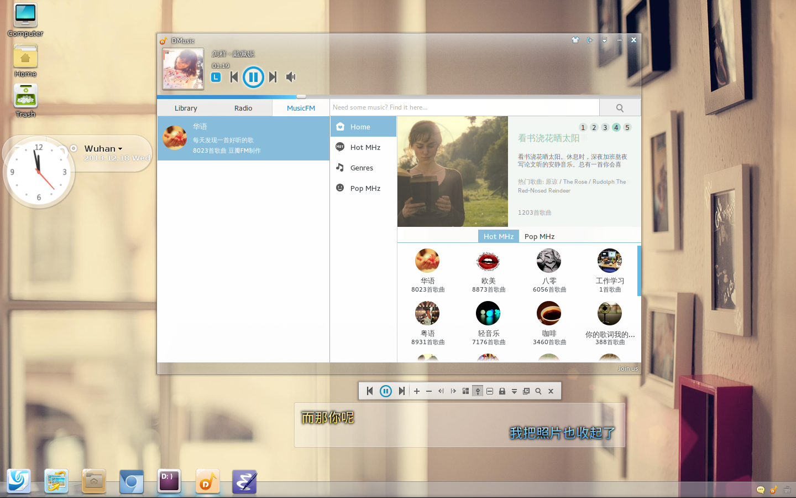

# Description

A collection of software of Linux Deepin that ported to Archlinux.
The pacakge are host on
[AUR](https://aur.archlinux.org/packages/?O=0&C=0&SeB=nd&K=deepin&outdated=&SB=n&SO=a&PP=50&do_Search=Go),
and they are all maintained automatically by
[pkgbuidup](https://github.com/fasheng/pkgbuildup), and will update
weekly.

# Screenshot

## desktop 1

## desktop 2

## desktop 3

# License

GNU General Public License, Version 3.0
