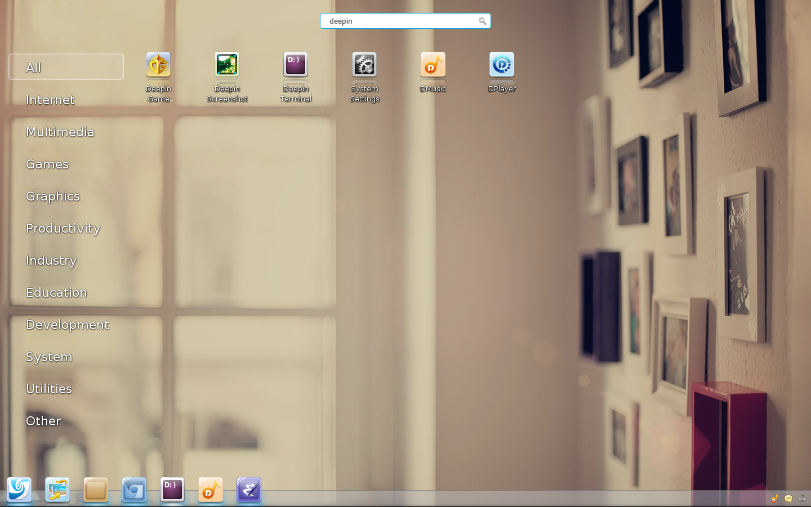

# Description

A collection of software from Linux Deepin that ported to Archlinux.
The pacakges are all host on
[AUR](https://aur.archlinux.org/packages/?O=0&C=0&SeB=nd&K=deepin&outdated=&SB=n&SO=a&PP=50&do_Search=Go),
and they are maintained automatically by
[pkgbuidup](https://github.com/fasheng/pkgbuildup), if there is no
accident, the packages will update weekly.

  
# Launch DDE
  Then we can use either lightdm or xinit to launch DDE, if use xinit,
  specific configuration is as follows:
  
  1 Add the following code to `$HOME/.xinitrc`
  
     exec startdde
        
  2 run xinit in tty to enter DDE
  
# Issues
  - `dde-shutdown` will make screen blocked now, so please just do not press `Ctrl-Alt-Delete`
    
# Troubleshooting
  - Why network in deepin-control-center not working?
  
     LinuxDeepin manage network through NetworkManager, so don't
     forget to start it,
     
         sudo systemctl start NetworkManager
     
     And if you want to experience DDE for a long time, use
     NetworkManager instead of netctl is a better choice,
     
         sudo systemctl stop netctl
         sudo systemctl disable netctl
         sudo systemctl stop netctl@ethernetdhcp
         sudo systemctl disable netctl@ethernetdhcp
         sudo systemctl enable NetworkManager
         sudo systemctl start  NetworkManager
         sudo systemctl enable ModemManager
         sudo systemctl start ModemManager

# Screenshot

# License

GNU General Public License, Version 3.0
