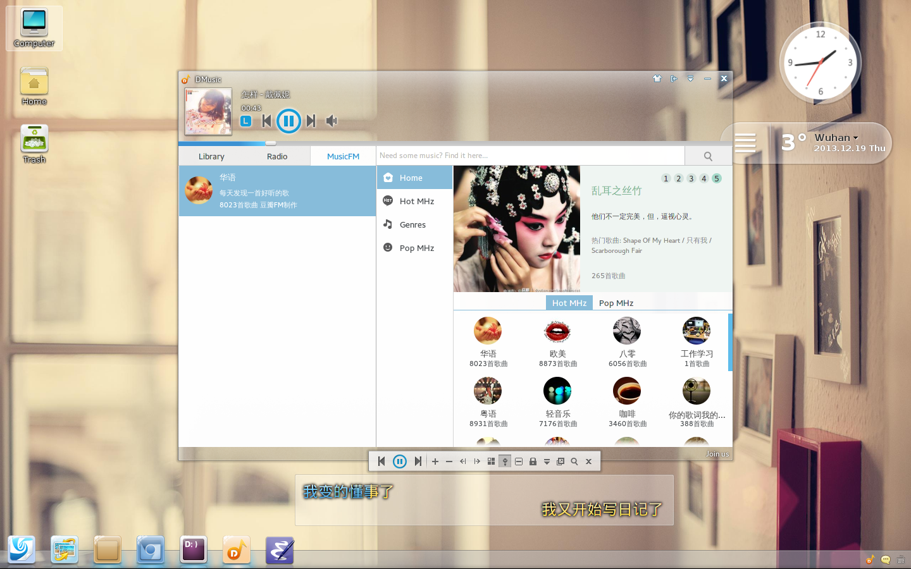

# Description

A collection of software from Linux Deepin that ported to Archlinux.
The pacakges are all host on
[AUR](https://aur.archlinux.org/packages/?O=0&C=0&SeB=nd&K=deepin&outdated=&SB=n&SO=a&PP=50&do_Search=Go),
and they are maintained automatically by
[pkgbuidup](https://github.com/fasheng/pkgbuildup), if there is no
accident, the packages will update weekly.

# Install

    yaourt -S --noconfirm deepin-desktop-environment deepin-notifications deepin-system-tray deepin-artwork deepin-system-settings

  Please keep a little patience, it will take several minutes, and be
  careful, when installing `compiz-dev`, need to edit PKGBUILD
  manually to enable gtk-window-decorator, like such:
  `GTKWINDOWDECORATOR="on"`.
  
  Note: the `deepin-webkit` will take a long time to compile(about 2
  hours), download and install the compiled .tar.xz file is another
  choice:
  
  - [deepin-webkit-git20131010153235~9ac8cf628b-1-i686.pkg.tar.xz](http://download.opensuse.org/repositories/home:/metakcahura/Arch_Extra/i686/deepin-webkit-git20131010153235~9ac8cf628b-1-i686.pkg.tar.xz)
  - [deepin-webkit-git20131010153235~9ac8cf628b-1-x86_64.pkg.tar.xz](http://download.opensuse.org/repositories/home:/metakcahura/Arch_Extra/x86_64/deepin-webkit-git20131010153235~9ac8cf628b-1-x86_64.pkg.tar.xz)
  
# Launch DDE
  For some packages are still in work, the ported DDE not support some
  feature in compiz, so we use `ccsm` instead, before launch DDE, run
  ccsm in other DE to enable the following plugins:
  
    window-decoration, and set the command to "gtk-window-decorator"
    application-switcher
    resize-window
        
  Then we can use either lightdm or xinit to launch DDE, if use xinit,
  specific configuration is as follows:
  
  1 Add the following code to `$HOME/.xinitrc`
  
     (sleep 2; desktop)&
     (sleep 2; dock)&
     exec compiz ccp
        
  2 run xinit in tty to enter DDE
  
# Problem packages
  - deepin-compiz, need boost 1.53
  - deepin-gnome-settings-daemon, need gnome 3.8

# Issues
  For the problem pacakges, the DDE is not perfect now, and the following
  components will bring you some trouble:

  - deepin-dock, if press the minimized window, it will not be restored
  - deepin-desktop-environment-plugins, the plugins will be placed in
    the wrong position
  - deepin-system-settings, some modules are out of work
    - display
    - sound
    - keyboard
    - network
    - additional drivers
    
# Screenshot

## desktop 1

## desktop 2

## desktop 3

## desktop 4

# License

GNU General Public License, Version 3.0
