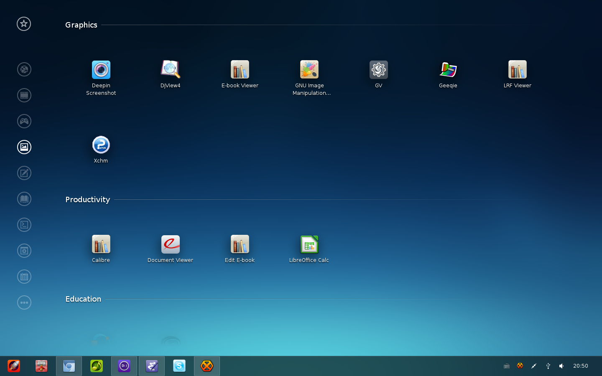
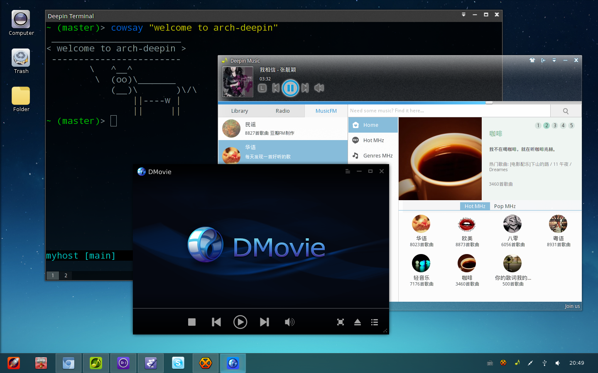

# Install

Add following code to `/etc/pacman.conf` (if you downloading or
checking packages with problem, just use the alternative server):

    [home_metakcahura_arch-deepin_Arch_Extra]
    SigLevel = Never
    Server = http://download.opensuse.org/repositories/home:/metakcahura:/arch-deepin/Arch_Extra/$arch
    #Server = http://anorien.csc.warwick.ac.uk/mirrors/download.opensuse.org/repositories/home:/metakcahura:/arch-deepin/Arch_Extra/$arch

Then:
    
    sudo pacman -Sy deepin
  
If you want to experience more applications from Deepin, etc
`deepin-music` and `deepin-movie`, just install deepin-extra:

    sudo pacman -Sy deepin-extra
  
# Launch DDE

  We can use either lightdm or xinit to launch DDE, if use xinit,
  specific configuration is as follows:
  
  1. Add the following code to `$HOME/.xinitrc`
  
     exec startdde
        
  2. run xinit in tty to enter DDE

# Troubleshooting

  - How to report debugging information of deepin?
    
    Just use journalctl, for example, the following command will
    print all deepin related log messages since boot:

       journalctl -b | grep -i 'deepin'
  
  - Why network in deepin-control-center not working?
  
    LinuxDeepin manage network through NetworkManager, so don't
    forget to start it,
     
        sudo systemctl start NetworkManager
     
    And if you want to experience DDE for a long time, using
    NetworkManager instead of netctl is a better choice,
     
        sudo systemctl stop netctl
        sudo systemctl disable netctl
        sudo systemctl stop netctl@ethernetdhcp
        sudo systemctl disable netctl@ethernetdhcp
        sudo systemctl enable NetworkManager
        sudo systemctl start  NetworkManager
        sudo systemctl enable ModemManager
        sudo systemctl start ModemManager

# Screenshot

# License

GNU General Public License, Version 3.0
